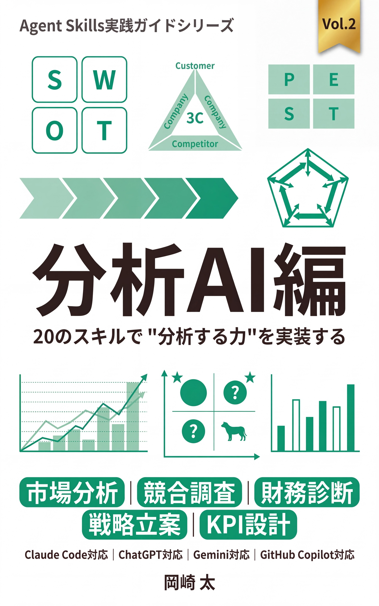
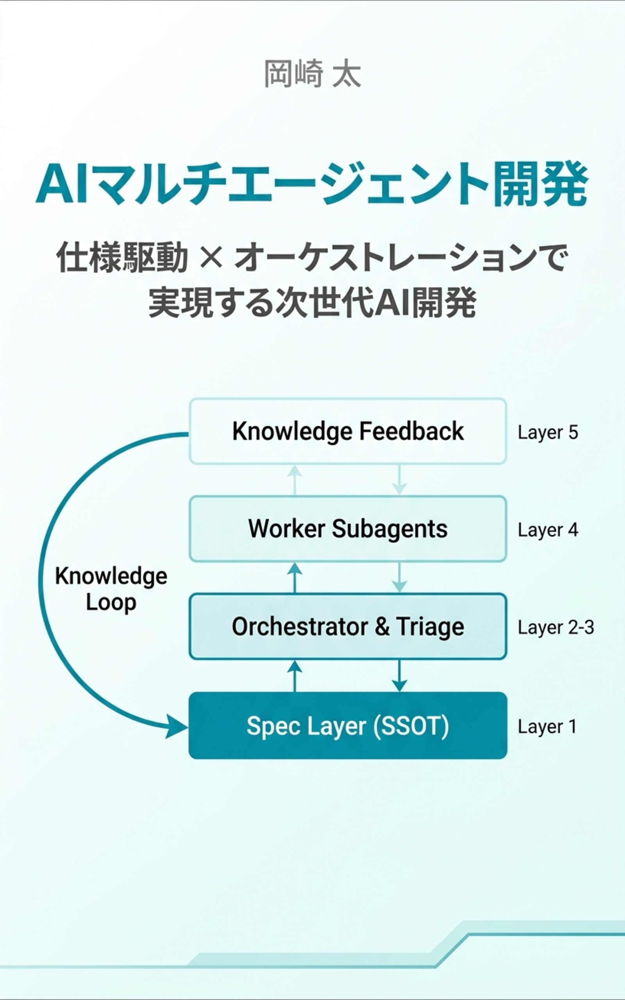

# AI Spec-Driven Development

AI開発ツール（Claude Code、GitHub Copilot、Cursor）に最適化された**7文書構造**を起点とするドキュメント戦略フレームワーク。

従来の60+文書から**最小7文書**で始動 ── AIが迷わず理解できる高品質ドキュメントでプロジェクトを駆動し、成長に応じて拡張します。

## 導入方法

3つの方法でプロジェクトに導入できます。

### 方法A: テンプレートをコピー（最もシンプル）

[`docs-template/`](./docs-template/) からコア7文書とフォルダ構造をプロジェクトにコピー:

```bash
# テンプレートをコピー
cp -r docs-template/MASTER.md your-project/docs/
cp -r docs-template/01-context/ your-project/docs/
cp -r docs-template/02-design/ your-project/docs/
cp -r docs-template/03-implementation/ your-project/docs/
cp -r docs-template/04-quality/ your-project/docs/
cp -r docs-template/05-operations/ your-project/docs/
cp -r docs-template/06-reference/ your-project/docs/
```

### 方法B: Claude Code Skills で初期化

Claude Code でこのリポジトリを参照し、スラッシュコマンドで自動セットアップ:

```
/init-docs          # コア7文書 + 拡張フォルダ構造を初期化
/validate-docs      # ドキュメント要件を検証
/setup-ai-config    # CLAUDE.md / .cursorrules / copilot-instructions.md を生成
```

### 方法C: MCP Server で AI ツール連携

MCP対応クライアント（Claude Code, Claude Desktop等）にサーバーを登録:

```json
{
  "command": "node",
  "args": ["/path/to/ai-spec-driven-development/mcp/dist/index.js"]
}
```

詳細: [`mcp/README.md`](./mcp/README.md)

## セットアップ

```bash
git clone https://github.com/feel-flow/ai-spec-driven-development.git
cd ai-spec-driven-development
npm install && npm run setup
```

大規模な `node_modules` や `git worktree` を併用する開発環境では、macOS のファイルディスクリプタ上限設定も推奨です。詳細は [docs/MAXFILES_SETUP_GUIDE.md](./docs/MAXFILES_SETUP_GUIDE.md) を参照してください。

### ACE ナレッジキャプチャの autonomous 化（任意）

PR マージ後の `/ace-curate` 手動実行を、**別プロセスの subagent + git worktree** に任せる推奨パターンがあります（feature flag でデフォルト無効）。テンプレートと運用手順は次を参照してください。

- [ace-autonomous.md](./docs-template/05-operations/deployment/ace-autonomous.md)（概要・4 ガード・shadow 運用）
- [docs-template/scripts/ace/README.md](./docs-template/scripts/ace/README.md)（配置ファイル一覧）

### 利用可能なコマンド

| コマンド                             | 説明                                                                                         |
| ------------------------------------ | -------------------------------------------------------------------------------------------- |
| `npm run setup`                      | 依存関係インストール + MCP サーバービルド                                                    |
| `npm run validate`                   | コア7文書の存在と構造の検証                                                                  |
| `npm run check`                      | MCP サーバーの動作確認                                                                       |
| `npm run build:mcp`                  | MCP サーバーのビルド                                                                         |
| `npm run quality:local`              | PR 前の品質ゲート（旧 `CI` ワークフローと同順。`npm ci` および `mcp ci` は未含）             |
| `npm run lint:md`                    | markdownlint（従来 CI と同条件のパス指定）                                                   |
| `npm run setup:labels`               | GitHub ラベルの自動セットアップ                                                              |
| `bash scripts/setup-multi-review.sh` | Multi-CLI Review Agent のセットアップ                                                        |

品質ゲートの全体像・リリース手動フローは [docs/NO_GITHUB_ACTIONS_MIGRATION_DESIGN.md](./docs/NO_GITHUB_ACTIONS_MIGRATION_DESIGN.md) を参照してください。ルートの `package.json` に `format:md` はありません（誤った README 表記は上記のとおりとします）。

**ブランチ保護で「CI」必須ステータスを要求している場合**: ワークフロー削除後は該当チェックが付かなくなるため、リポジトリ管理者が保護ルールの**必須ステータス**を更新する必要がある場合があります。

### Multi-CLI Review Agent

5つのAI CLI を並列実行し、異なるモデルの観点からコードレビューを行うオーケストレーションシステム。

```bash
# セットアップ（yq インストール、CLI検出、動作確認）
bash scripts/setup-multi-review.sh

# レビュー実行
bash scripts/multi-review.sh              # 全CLI並列（デフォルト）
bash scripts/multi-review.sh --dry-run    # 実行プランのみ確認
bash scripts/multi-review.sh --strategy minimize_cost  # コスト最小化モード
```

Claude Code からはスラッシュコマンドで実行できます:

```
/multi-review                              # デフォルト（全CLI並列）
/multi-review --strategy minimize_cost     # コスト最小化
/multi-review --cli codex-cli              # 特定CLIのみ
```

| CLI          | コスト    | デフォルト観点                     |
| ------------ | --------- | ---------------------------------- |
| Claude Code  | Premium   | 型設計分析                         |
| Codex CLI    | Standard  | コードレビュー、エラーハンドリング |
| Copilot CLI  | Flat-rate | テスト分析、コメント分析           |
| Gemini CLI   | Free-tier | セキュリティ分析                   |
| Cursor Agent | Flat-rate | コード簡素化                       |

設定: [`scripts/review-config.yaml`](./scripts/review-config.yaml) | 詳細: [`multi-cli-review-orchestration.md`](./docs-template/05-operations/deployment/multi-cli-review-orchestration.md)

## 7文書構造（起点）

```
docs/
├── MASTER.md                    # 中央管理ハブ（必須・最初に読む）
├── 01-context/
│   ├── PROJECT.md               # ビジョンと要件
│   └── CONSTRAINTS.md           # 制約条件
├── 02-design/
│   ├── ARCHITECTURE.md          # システム設計
│   └── DOMAIN.md                # ビジネスロジック
├── 03-implementation/
│   └── PATTERNS.md              # 実装パターン
├── 04-quality/
│   └── TESTING.md               # テスト戦略
├── 05-operations/
│   └── DEPLOYMENT.md            # 運用手順
└── 06-reference/
    ├── GLOSSARY.md              # 用語集
    └── DECISIONS.md             # 設計判断記録
```

**なぜ7文書から始めるか**: AIツールは情報の散在に弱い。まず7文書に集約してコンテキスト理解の精度を確保し、プロジェクトの成長に応じて各フォルダ内に文書を追加していく。全文書が揃わなくてもAIと対話しながら段階的に仕様を策定できる。詳細は [AI Spec Driven Development 概念と実践](./docs/AI_SPEC_DRIVEN_DEVELOPMENT.md) を参照。

## 関連書籍

本フレームワークの背景と実践を解説する書籍を含む、AI開発シリーズの全 11 冊です。

### Agent Skills 実践ガイド シリーズ

<table>
  <tr>
    <td width="160" valign="top" align="center">
      
    </td>
    <td valign="top">
      <h4>Agent Skills 実践ガイド</h4>
      <p><em>AIエージェントに専門知識を渡す技術</em></p>
      <p>Agent Skillsのオープン標準に基づき、AIエージェントに専門知識を渡す方法を解説。レビュー、執筆、ナレッジ参照、コード生成など、多様な活用パターンを実例とともに紹介。Claude Code, Cursor, GitHub Copilot, OpenAI Codex, Gemini CLI など27以上のツールで使えるスキルの設計と実装を学ぶ。</p>
      <p><strong>Kindle</strong>: 準備中</p>
    </td>
  </tr>
</table>

<table>
  <tr>
    <td width="160" valign="top" align="center">
      
    </td>
    <td valign="top">
      <h4>Vol.1 思考AI編</h4>
      <p><em>15のスキルで「考える力」を実装する</em></p>
      <p>15の思考フレームワーク（ロジカルシンキング、仮説思考 ほか）をAgent SkillsとしてAIに実装し、たった1言で「考える力」を呼び出す技術を体系化。AIを道具として使いこなし、自分の判断力を拡張したい人のための本。</p>
      <p><strong>Kindle</strong>: 準備中</p>
    </td>
  </tr>
</table>

<table>
  <tr>
    <td width="160" valign="top" align="center">
      
    </td>
    <td valign="top">
      <h4>Vol.2 分析AI編</h4>
      <p><em>20のスキルで「分析する力」を実装する</em></p>
      <p>SWOT・3C・BCGなど、コンサルの分析フレームワーク20選をAgent SkillsとしてAIに実装し、たった1言で「分析する力」を呼び出す技術を体系化。AIを道具として使いこなし、自分の分析力を拡張したい方のための本。</p>
      <p><strong>Kindle</strong>: 準備中</p>
    </td>
  </tr>
</table>

<table>
  <tr>
    <td width="160" valign="top" align="center">
      
    </td>
    <td valign="top">
      <h4>Vol.3 提案AI編</h4>
      <p><em>15のスキルで「提案を通す力」を実装する</em></p>
      <p>ストーリーテリング・期待値コントロール・交渉術の15スキルをAgent SkillsとしてAIに実装し、たった1言で「提案を通す力」を呼び出す技術を体系化。AIを道具として使いこなし、自分の提案力を拡張したい人のための本。</p>
      <p><strong>Kindle</strong>: 準備中</p>
    </td>
  </tr>
</table>

### 単巻

<table>
  <tr>
    <td width="160" valign="top" align="center">
      
    </td>
    <td valign="top">
      <h4>AI仕様駆動開発</h4>
      <p><em>AIエージェント開発の新常識</em></p>
      <p>AIが仕様に基づいて安全に開発を実行できるよう、コア7文書構成で開発プロセスを定義。手戻りゼロの開発フローを実現する体系的なメソッド。Claude Code / GitHub Copilot / Cursor を使うエンジニア・テックリード向け。本リポジトリの背景となる書籍。</p>
      <p>
        <strong>Kindle</strong>: <a href="https://www.amazon.co.jp/dp/B0GHHVX1NY">Kindleストアで見る</a> ｜
        <strong>ペーパーバック</strong>: <a href="https://amzn.asia/d/03bcN32G">Amazon.co.jpで見る</a>
      </p>
    </td>
  </tr>
</table>

<table>
  <tr>
    <td width="160" valign="top" align="center">
      
    </td>
    <td valign="top">
      <h4>コンテキストエンジニアリング入門</h4>
      <p><em>9割のエンジニアが知らないLLMの3つの死角</em></p>
      <p>AI仕様駆動開発の原点となる理論書。Lost in the Middle、Lost at the Beginning of Reasoning、70%問題——LLMが抱える3つの死角を科学的に解説し、コンテキスト縮小戦略とスコープ収束パターンでAIの精度を意図的に設計する方法を学ぶ。</p>
      <p>
        <strong>Kindle</strong>: <a href="https://www.amazon.co.jp/dp/B0F1S6KF5Q">Kindleストアで見る</a> ｜
        <strong>ペーパーバック</strong>: <a href="https://amzn.asia/d/07ycceB8">Amazon.co.jpで見る</a>
      </p>
    </td>
  </tr>
</table>

<table>
  <tr>
    <td width="160" valign="top" align="center">
      
    </td>
    <td valign="top">
      <h4>AI開発マネジメント</h4>
      <p><em>7つのフェーズ・21のAgent Skillで開発ライフサイクルを制する</em></p>
      <p>要件定義からリリースまで、AI開発ライフサイクルを7つのフェーズに分解し、各フェーズで必要となる21のAgent Skillを体系化。プロジェクトを設計・計画・実装・検証・運用するための実践メソッド。</p>
      <p><strong>Kindle</strong>: 準備中</p>
    </td>
  </tr>
</table>

<table>
  <tr>
    <td width="160" valign="top" align="center">
      
    </td>
    <td valign="top">
      <h4>AIマルチエージェント開発</h4>
      <p><em>仕様駆動 × オーケストレーションで実現する次世代AI開発</em></p>
      <p>仕様をSSOT（単一情報源）として、開発ワークフロー全体をオーケストレーターが状態管理し、Subagentを動的編成・監視・制御する次世代フレームワーク。5レイヤーアーキテクチャとACEナレッジループで、マルチエージェント開発をスケールさせる設計論。</p>
      <p><strong>Kindle</strong>: 準備中</p>
    </td>
  </tr>
</table>

<table>
  <tr>
    <td width="160" valign="top" align="center">
      
    </td>
    <td valign="top">
      <h4>AI時代の新しい職業図鑑</h4>
      <p><em>AIオーケストレーターという働き方</em></p>
      <p>学生・ビジネスパーソン向けのキャリアガイド。AIオーケストレーターという新しい職業を定義し、必要なスキルセット、キャリアパス、就職市場での位置づけを解説。AI時代のキャリア戦略を学ぶ。</p>
      <p><strong>Kindle</strong>: 準備中</p>
    </td>
  </tr>
</table>

<table>
  <tr>
    <td width="160" valign="top" align="center">
      <div>📕<br><sub>Cover<br>準備中</sub></div>
    </td>
    <td valign="top">
      <h4>Claudeで作る外資コンサル品質スライド</h4>
      <p><em>AI戦略スライド生成設計メソッド</em></p>
      <p>Claude Opus 4.6を活用し、McKinsey、BCG、Bain、Accenture、Deloitte、PwC、EY、KPMG など外資系コンサルティングファーム品質のスライドを生成する設計メソッドを体系化。プロンプト設計からファーム別スタイル再現まで、再現性ある手法を解説。</p>
      <p><strong>Kindle</strong>: 準備中</p>
    </td>
  </tr>
</table>

<table>
  <tr>
    <td width="160" valign="top" align="center">
      <div>📗<br><sub>Cover<br>準備中</sub></div>
    </td>
    <td valign="top">
      <h4>ハーネスエンジニアリング入門</h4>
      <p><em>AIバイブコーディングが破綻する前に決めておく6層の設計規律</em></p>
      <p>AI前提のバイブコーディングで、型 → 設定 → リポジトリ → サービス → ランタイム → UI の 6 層ハーネスで設計規律を敷き、不変条件を Agent Skills としてパッケージ化。Clean Architecture・Ports & Adapters との統合整理を含む、AI が破綻させない土台の作り方。</p>
      <p><strong>Kindle</strong>: 準備中</p>
    </td>
  </tr>
</table>

## ドキュメント

### 概念・ガイド

- [AI Spec-Driven Development 概念と実践](./docs/AI_SPEC_DRIVEN_DEVELOPMENT.md) — 7文書から始めて段階的に拡張する戦略
- [AI駆動 Git Workflow](./docs/AI_GIT_WORKFLOW.md) — AIに最適化された10ステップのワークフロー
- [運用ガイド (AIエージェント向け)](./docs/OPERATIONAL_GUIDE.md) — AIエージェントの操作仕様書
- [OS ファイルディスクリプタ上限の設定ガイド](./docs/MAXFILES_SETUP_GUIDE.md) — macOS / Windows の fd 上限設定と VS Code 安定化手順

### Quick Start

| 対象             | ガイド                                                                                       | 所要時間  |
| ---------------- | -------------------------------------------------------------------------------------------- | --------- |
| 完全初心者       | [GETTING_STARTED_ABSOLUTE_BEGINNER.md](./docs-template/GETTING_STARTED_ABSOLUTE_BEGINNER.md) | 約4.5時間 |
| 新規プロジェクト | [GETTING_STARTED_NEW_PROJECT.md](./docs-template/GETTING_STARTED_NEW_PROJECT.md)             | 8-12時間  |
| 既存プロジェクト | [GETTING_STARTED.md](./docs-template/GETTING_STARTED.md)                                     | 約2時間   |

### AIツール設定ガイド

| ツール         | ガイド                                                             | 設定ファイル                      |
| -------------- | ------------------------------------------------------------------ | --------------------------------- |
| Claude Code    | [SETUP_CLAUDE_CODE.md](./docs-template/SETUP_CLAUDE_CODE.md)       | `CLAUDE.md`                       |
| GitHub Copilot | [SETUP_GITHUB_COPILOT.md](./docs-template/SETUP_GITHUB_COPILOT.md) | `.github/copilot-instructions.md` |
| Cursor         | [SETUP_CURSOR.md](./docs-template/SETUP_CURSOR.md)                 | `.cursorrules`                    |

## AIエージェント向け

すべてのAIエージェントは作業開始前に [`docs-template/MASTER.md`](./docs-template/MASTER.md) を必ず読んでください。

- **Claude Code**: [`CLAUDE.md`](./CLAUDE.md)
- **GitHub Copilot**: [`.github/copilot-instructions.md`](./.github/copilot-instructions.md)
- **Cursor**: [`.cursorrules`](./.cursorrules)
- **その他**: [`AGENTS.md`](./AGENTS.md)

## ライセンス

[MIT License](./LICENSE)

## リリース

- [CHANGELOG.md](./CHANGELOG.md)
- [Releases](https://github.com/feel-flow/ai-spec-driven-development/releases)

---

**FEEL-FLOW** | [https://feelflow.co.jp](https://feelflow.co.jp) | 最終更新: 2026年2月
